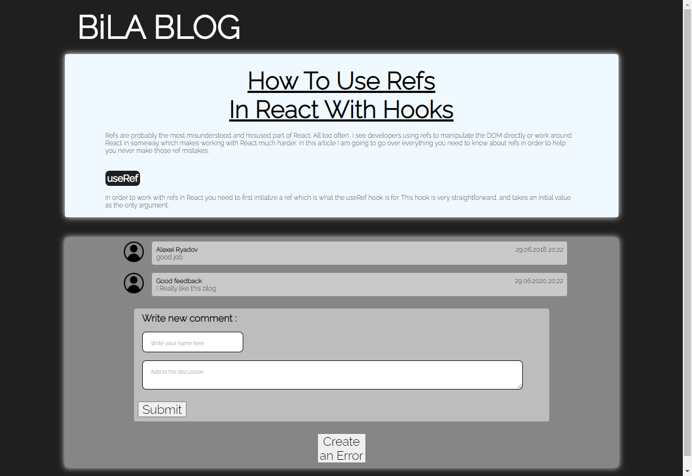

# This is my Blog Post app!
The app shows how to use refs in react with hooks.

Refs are probably the most misunderstood and misused part of React. All too often, I
see developers using refs to manipulate the DOM directly or work around React in
someway which makes working with React much harder. In this article I am going to go
over everything you need to know about refs in order to help you never make those
ref mistakes.

In order to work with refs in React you need to first initialize a ref which is what
the useRef hook is for. This hook is very straightforward, and takes an initial
value as the only argument.

app link: https://blog-post-ppage.vercel.app/

my gif:
